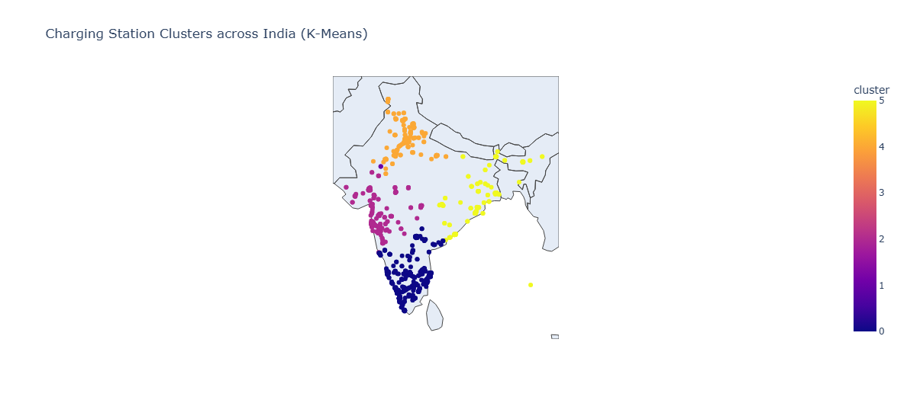

# 🚗 EV Data Visualization and Analysis Project

This is the official code repository for EDADV Course Project: Electric Vehicle Data Analysis.

## 📌 Project Overview
This project analyzes global and Indian Electric Vehicle (EV) growth trends using real datasets.
It includes statistical analysis, visualizations, and geospatial mapping to understand the role of
charging infrastructure, government policies, and technology in EV adoption.

## 🎯 Project Objectives

- Analyze global EV sales (2010-2024)
- Study India’s charging infrastructure growth
- Perform geospatial mapping and clustering
- Compare EV growth: China vs India
- Identify correlation between EV sales and charging stations

## 📁 Repository Structure

```
EV-Data-Visualization-Project/
│
├── data/                # Raw datasets  
├── plots/               # Output visualizations  
├── scripts/             # Python code files  
│
├── README.md  
├── LICENSE  
└── .gitignore  
```
## 🚀 How to Run

### 1️⃣ Clone the repository
```bash
git clone https://github.com/ananya-singh21/EV-Data-Visualization-Project.git
```
### 2️⃣ Install required packages
```bash
pip install -r requirements.txt
```
### 3️⃣ Run any script or notebook
```bash
python scripts/evcharges.py
```

## 📌 Folder Guide

```bash
data/       → raw datasets  
scripts/    → Python files & analysis  
plots/      → output graphs  
README.md   → project summary  
LICENSE     → open-source license
```

## 📚 Dataset Sources

1. Global EV Data Explorer (IEA)  
   https://www.iea.org/data-and-statistics/data-tools/global-ev-data-explorer

2. EV Charging Stations in India (Kaggle)  
   https://www.kaggle.com/datasets/saketpradhan/electric-vehicle-charging-stations-in-india

3. Correlation EV Sales vs Chargers (internal CSV included in `data/`)

## 📈 Example Visualizations

Here are some of the plots generated in the project:




## 📝 Conclusion

This project demonstrates the relationship between EV adoption and charging
infrastructure using real-world datasets, geospatial mapping, and correlation
analysis. It can be extended further using forecasting models and policy analysis.

## 👥 Team Members

- Kartik Suttraway
- Namokar Kasture
- Pavan Khajukar
- Ananya Singh
